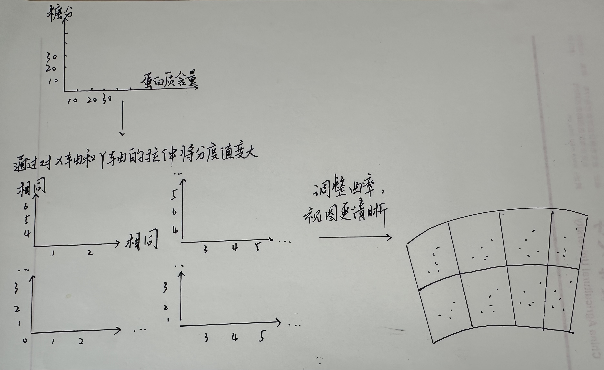
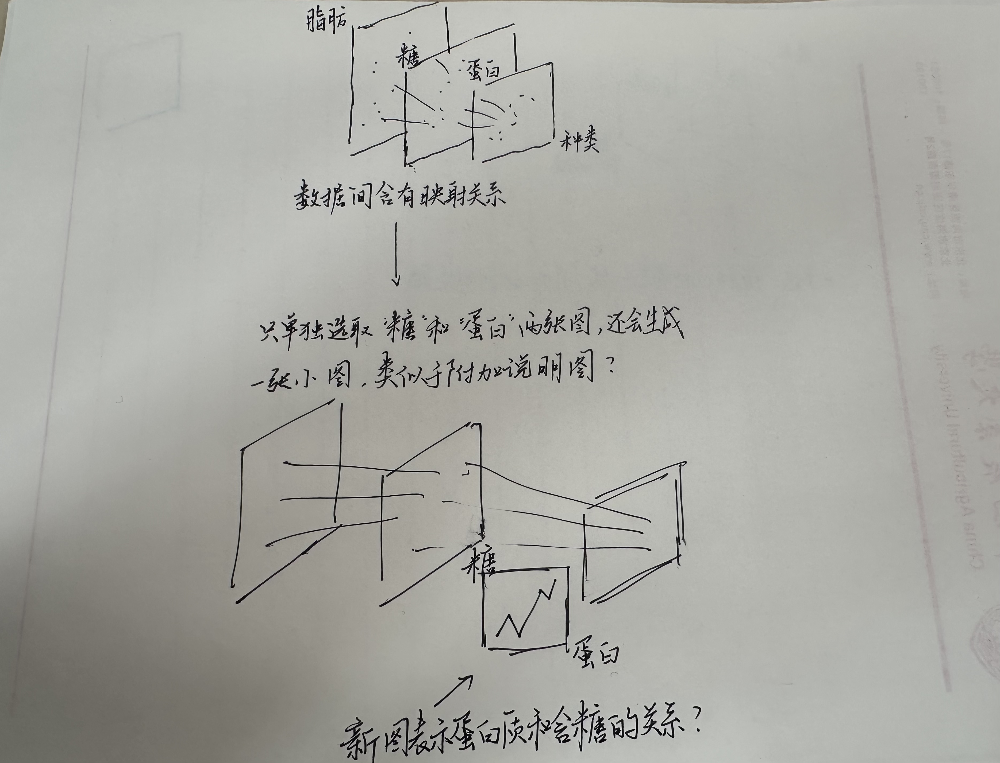
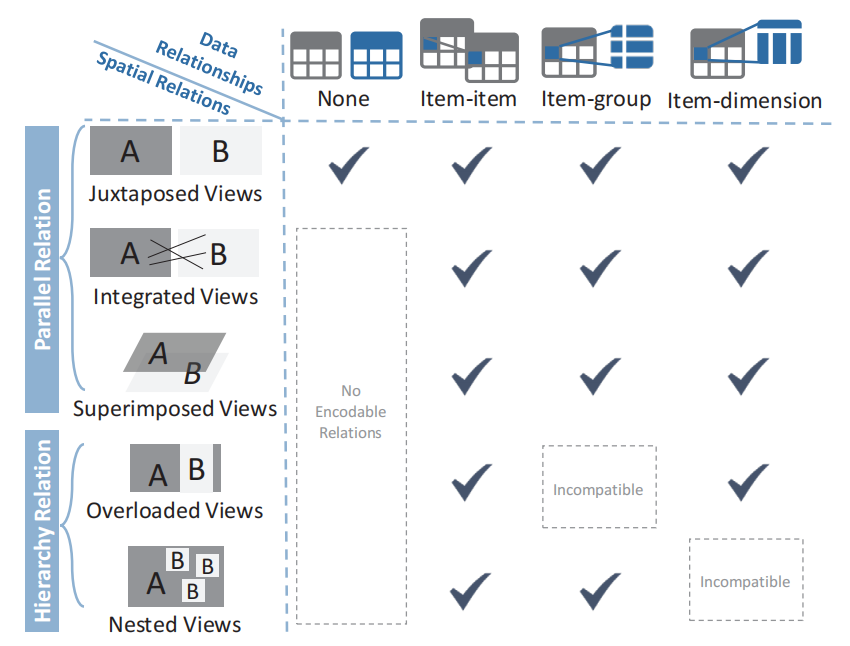

# CompositingVis：Exploring Interactions for Creating Composite Visualizations in Immersive Environments
涉及到的高频词：composite（组合） / immersive（沉浸式） / embodied（具体的）
## 论文主要工作
1. 对呈现在不同图表上的数据进行两者之间的关系分类，具体关系有：None / Item-item / Item-group / Item-dimension （后面两者有点像似于矩阵？）
2. 针对不同的数据分类，可以对在已有的图的基础上组合成特定类型的图片，便于进行数据分析。组合图片中图与图之间的关系可以归类为以下五种：并列 / 连接（图片同级 / 图片之间的数据存在关系） / 叠加（图片同级 / 这个图感觉是为了更直观地呈现效果） / Overload view（图片间的关系变为父图和子图 / 更像是附上一张小图在大图中） / Nested view（图片间的关系是父图和子图 / 更像小图直接替换了大图的一部分，是嵌进去的）。
## 详细论文细节
### 讲故事
1. 在related中主要讲了三点：有人做过这些组合图（但是没办法用户自己做） / 有软件是可以实现交互做图的 / 有人做过这方面的研究。
2. 我们也干这方面的工作，这篇论文的工作解决了如下几个问题：明确要做几种类型的可视化？ / 基础图中图与图底层的数据关系是什么？ / 如何把数据关系和可视化类型对应起来（这个有点闭环到第一个问题）。
### 系统（重点在4.3阐述）
1. 阐述系统的操作对象都有哪些：整个视图 / 图表上的元素，具体到线和电（这里论文定义为data element） / 图标的坐标轴（论文定义为Non-data element）。
2. 阐述用户可以对图表可以进行如下操作：改图表的位置 / 对图表进行选择 / 对图表进行缩放 / 对图表进行调整。
3. 系统的设计原则：上手简单，不要让用户学得要死要活 / 系统能通人性，知道用户想要干什么 / 系统的反馈要及时，出现新的图时高亮显示。
### 5.1
我其实没有很看懂是什么意思，这个图是不是这样的？（或许刻度和图注写上会清楚些）

### 5.4
我依旧没有很理解，或许我猜要表达的意思是这样的？

### 5.2 / 5.3 / 5.5呈现得很清晰

## 问题
我有点不理解这个图背后的原理：Item-group和Item-dimension应该是“行”和“列”的区别，那为什么因为这个区别，行只能生成Overload view而列只能生成Nested view？
