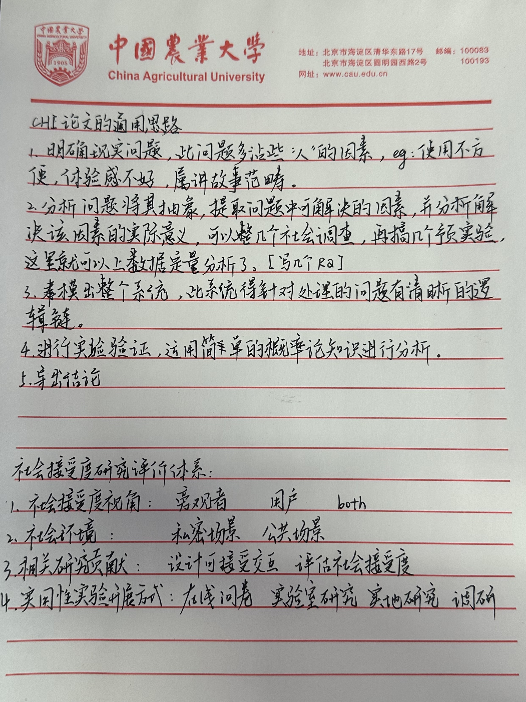

# Make Interaction Situated: Designing User Acceptable Interaction for Situated Visualization in Public Environments
## 我有点没理解两个地方
1. “context”这个单词要做什么解释？到底是考虑交互使用的“背景”（这里更像一个定性的场景），还是考虑交互使用的上下文（有点随机性，比如在使用交互之前发生了什么）？
2. spatially-aware interaction and the tangible touch interaction,这两个触摸的区别在哪？
## 前置知识
1. Vuforia target：一种识别，有点像语义分割。
2. p：在文章中用来衡量是否具有统计学意义，p < 0.05具有统计学意义 / p < 0.01具有高度统计学意义。
3. z：在文章中用来检验差异的大小，绝对值越大差异越显著。
4. Effect Size：效应量，衡量差异大小，0.2=小 / 0.5=中 / 0.8=大。
## 具体文章
1. 系统的交互呈现如下：先总体类别呈现 / 然后一一比较。AR的呈现必须在一个固定的区域，且呈现的时候不能阻挡到实际物品。
2. 有一个提前的调查实验，这个调查实验没有用具体设备做，是用纸和透明纸来模拟（？）
3. 具体实验有两个任务，分别是自上而下的任务决策和自下而上的任务决策。
4. 有一个baseline，这个baseline也是我们自己的，它只是交互的时候要用一些比较尴尬的动作。
5. 有一些衡量标准：用户的主观体验 / 任务完成效率（时间、错误率、交互次数、注视和操作效率） / 社会接受度。
## 可以迁移的一些知识
