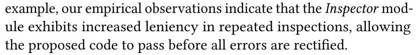
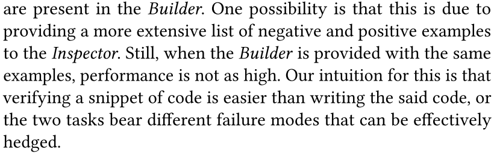
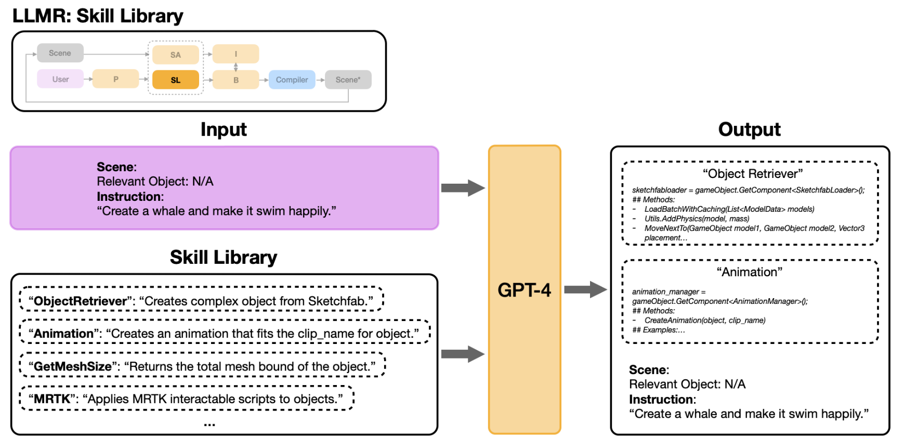

# LLMR: Real-time Prompting of Interactive Worlds using Large Language Models

## 杂话
大组 / 企业 做出来的文章确实牛逼，写得很清晰，而且工作很厉害。

## 文章结构
Section 2：回顾并梳理面向混合现实的三维物体与环境生成领域的现有研究工作及相关方法。

Section 3：先对本文提出的LLMR框架进行整体概述，再详细介绍框架中各个模块的功能与实现细节。

Section 4 5 6：分别论述本框架的重要扩展内容，包括插件集成、内存管理机制以及跨平台兼容性。

Section 7：展示一系列典型应用实例，以此说明LLMR能够支持的丰富创作场景与广泛用途。

Section 8（数值实验）：围绕设计目标对框架进行全面评估，包括高任务完成率、实时运行能力、复杂任务鲁棒性以及迭代微调能力等指标。

Section 9（用户研究）：对LLMR的生成效果质量进行评价，并整理与呈现系统的可用性反馈。

Section 10：总结本文工作的局限性，并展望未来可进一步拓展与深入研究的方向，为后续相关工作提供参考。

## 工作
1. 有一个“元提示”来更好地理解需求?
2. 首先从 **Planner（规划器）**开始，它会将用户的请求拆解为一系列粒度合适的指令序列。这些指令，结合 **Scene Analyzer（场景分析器）**对现有场景的简洁摘要，以及 **Skill Library（技能库）**中专业技能所需的额外知识，共同作为输入传给核心模块 **Builder（构建器）**，由其生成代码以完成这些指令。此外，系统还单独使用一个 **Inspector（检查器）**模块，在最终执行代码前，对 **Builder** 生成的代码进行检查，排查潜在的编译错误与运行时错误。
3. Planner 的核心作用是对用户需求进行任务分解与生成流程规划，从概率建模上简化代码生成过程（要满足一些假设）。
一次性生成完整代码的联合概率（原本）：$\mathcal{P}(x_1,\dots,x_N \mid u_1,\dots,u_N,\Omega)$。利用独立性假设简化条件简化代码：$\mathcal{P}(x_{n+1} \mid x^n, u_{n+1},\Omega)$。显著降低模型生成难度。
4. 建立Scene Analyzer有两个原因：一个是并不需要完整的场景，还有一个原因是费token。$\Omega$是Unity的场景,$s$是LLM的输入。
5. **2D目标生成 → 3D候选检索 → 双阶段相似度匹配选优**：使用DALL-E 2生成对应的**2D目标参考图**，作为后续匹配的基准 / 以物体标签为检索词，从开源3D模型平台Sketchfab批量下载潜在匹配模型的截图，构建3D候选图像池 / 使用CLIP模型，为所有3D候选截图 + 步骤1生成的2D目标图，统一生成特征嵌入（embedding），在语言相似度空间中，筛选出与目标最匹配的Top 5候选，在Top 5候选中，选择与2D目标图视觉相似度最高的模型，作为该物体的最终3D模型。
6. 有一个控制内存的机制，有以下好处：最直接的就是省token / 第二点文章在表达中举的是检查器的例子，如果反复检查的话最后的标准会变得宽松，其实就是AI对话长了会变傻的现象 / 有限的内存更好找错误。
7. 实现了代码级的适配：可以根据目标平台的SDK规范，自动生成符合的API、命名空间、开发规范的新代码，甚至能把过时、失效的旧代码，自动适配到新的SDK版本。

## 性能评估的实验设计
1. 在两个场景下评估：一个是全空的场景 / 一个是已有场景（浴室）。
2. 150个提示词，提示词不是人写的，是另一个GPT写的。但是GPT的提示是人写的。
3. 空场景测试从零开始生成的能力 / 已有场景测试修改颜色、添加物品、修改功能的能力。
4. 选择“代码”的错误率作为评价指标。同时提示词也有难度划分（这也是GPT干的）：
"The above are prompts that are given to a
system that can code and execute commands inside of Unity. We want
to measure how good this system is at coding in C# for Unity purposes.
Given your knowledge of Unity, please rate all of the prompts above
on a level of difculty from 1 to 10."
5. 根据不同难度的提示词进行实验，有的模型会随着难度上升表现变差，但是LLMR一直很好。
6. 评估需要一连串工作的任务：80个任务，每一个任务含有5个左右的子任务。主要是多步连续和强依赖历史。

## 写作
1. 每一个模块是边论述边推进的，比如Builder-Inspector部分就先说问题在于“模型强制要求要创造性贡献”，之后接着写是怎么解决这个问题的。
2. （这也算是一个问题）3.3 Builder-Inspector这里论文说了Inspector的引入是有效的并且自己分析了可能的原因，但是这好像是作者的推断？

3. 可以在写完每个模块的末段跟着现在还存在的问题，然后未来可以解决这种话。"We leave this for future explorations."
4. 加入的模块可以提供哪些优势？可以对比先前工作的模型。
5. 清晰地分类出系统的应用功能，并且进行阐述，这里要配上具体的系统应用场景图片。
6. LLMR一直能保持高指标之后，8.3马上论证了怎么难，把难分成了四类：技能复杂度、token复杂度、记忆复杂度、输出质量复杂度来论述怎么难。并且又一次解释了LLMR对于这些难问题的应对方法。
7. 做图上左上角有一个小框，对应这张图讲的模块在模型中的哪个位置。而且具体大图中，对应用户的模块始终是紫色。

