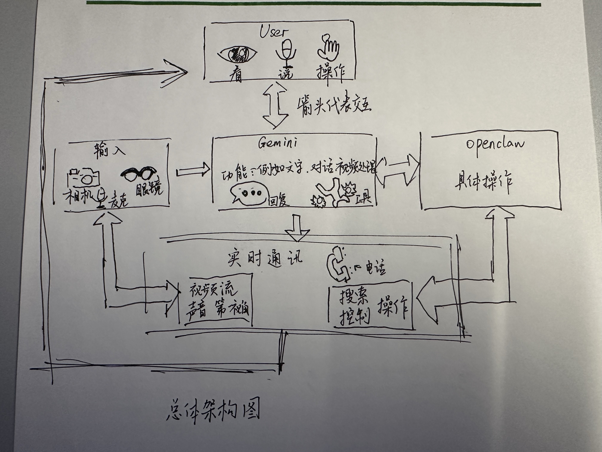
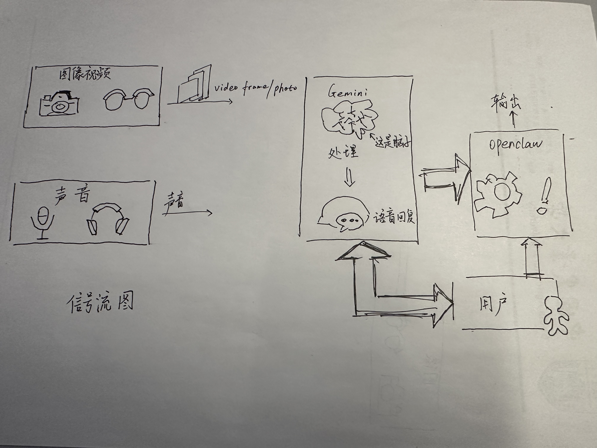

# VisionClaw
## 项目目录
```
samples
├─ CameraAccess (iOS 示例)
│  ├─ Gemini
│  │  ├─ AudioManager.swift              # 音频采集与播放
│  │  ├─ GeminiConfig.swift              # Gemini 配置
│  │  ├─ GeminiLiveService.swift         # 实时连接 Gemini
│  │  └─ GeminiSessionViewModel.swift    # 会话管理（核心）
│  │
│  ├─ OpenClaw
│  │  ├─ OpenClawBridge.swift            # 调用 OpenClaw API
│  │  ├─ OpenClawEventClient.swift       # 接收执行结果
│  │  ├─ ToolCallModels.swift            # 工具调用数据结构
│  │  └─ ToolCallRouter.swift            # 工具调度
│  │
│  ├─ WebRTC
│  │  ├─ CustomVideoCapturer.swift       # 视频采集
│  │  ├─ SignalingClient.swift           # 信令交换
│  │  ├─ WebRTCClient.swift              # WebRTC 核心
│  │  └─ WebRTCSessionViewModel.swift    # 会话管理
│  │
│  ├─ iPhone
│  │  └─ IPhoneCameraManager.swift       # 摄像头接入
│  │
│  ├─ ViewModels
│  │  ├─ StreamSessionViewModel.swift    # 流会话管理
│  │  ├─ WearablesViewModel.swift        # 设备连接管理
│  │  ├─ DebugMenuViewModel.swift        # 调试逻辑
│  │  └─ VideoDecoder.swift              # 视频解码
│  │
│  ├─ Views
│  │  ├─ MainAppView.swift               # App 主入口 UI
│  │  ├─ HomeScreenView.swift            # 首页
│  │  ├─ StreamView.swift                # 视频流界面
│  │  ├─ StreamSessionView.swift         # 会话界面
│  │  ├─ NonStreamView.swift             # 非流模式
│  │  └─ Components/                    # UI 组件（按钮/卡片等）
│  │
│  ├─ CameraAccessApp.swift              # iOS 入口
│  └─ Secrets.swift.example              # API Key 配置模板
│
├─ CameraAccessAndroid (Android 示例)
│  └─ app/src/main/java/.../cameraaccess
│
│     ├─ gemini                          # 多模态 AI（语音+视觉）
│     │  ├─ AudioManager.kt
│     │  ├─ GeminiConfig.kt
│     │  ├─ GeminiLiveService.kt
│     │  └─ GeminiSessionViewModel.kt
│     │
│     ├─ openclaw                        # 工具调用执行
│     │  ├─ OpenClawBridge.kt
│     │  ├─ OpenClawEventClient.kt
│     │  ├─ ToolCallModels.kt
│     │  └─ ToolCallRouter.kt
│     │
│     ├─ webrtc                          # 实时视频通信
│     │  ├─ CustomVideoCapturer.kt
│     │  ├─ SignalingClient.kt
│     │  ├─ WebRTCClient.kt
│     │  └─ WebRTCSessionViewModel.kt
│     │
│     ├─ phone
│     │  └─ PhoneCameraManager.kt        # 摄像头接入
│     │
│     ├─ stream
│     │  ├─ StreamingService.kt          # 视频流服务
│     │  ├─ StreamUiState.kt             # 状态定义
│     │  └─ StreamViewModel.kt           # 流逻辑
│     │
│     ├─ wearables
│     │  ├─ WearablesUiState.kt          # 设备状态
│     │  └─ WearablesViewModel.kt        # 设备管理
│     │
│     ├─ settings
│     │  └─ SettingsManager.kt           # 设置管理
│     │
│     ├─ mockdevicekit                   # 模拟设备
│     │
│     ├─ ui                              # UI 层（Compose）
│     │
│     └─ MainActivity.kt                 # Android 入口
│
└─ server
   ├─ index.js                           # 服务端入口（信令/网页）
   └─ public/index.html                  # 浏览器端页面
```
## 灵魂画手这一块

