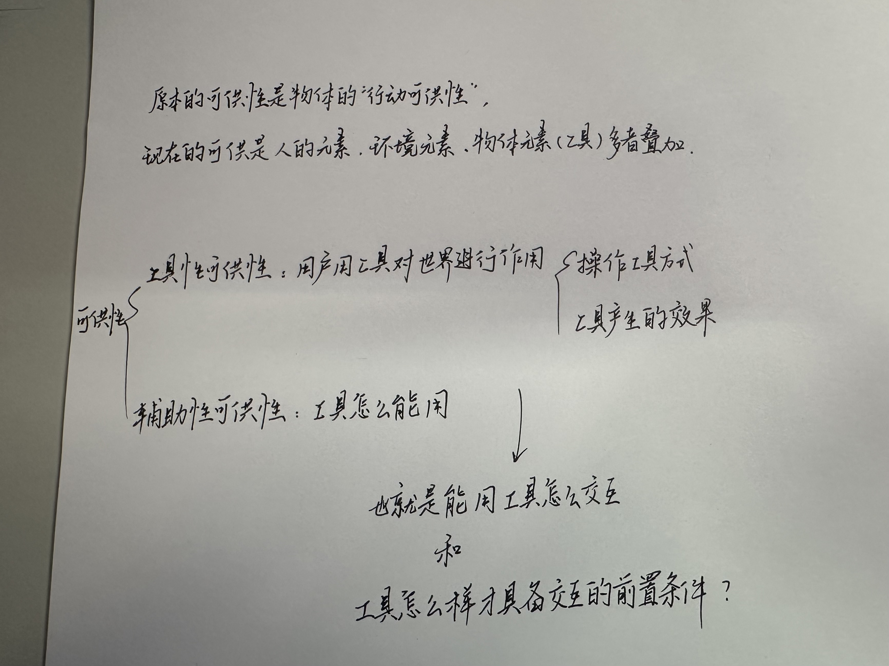
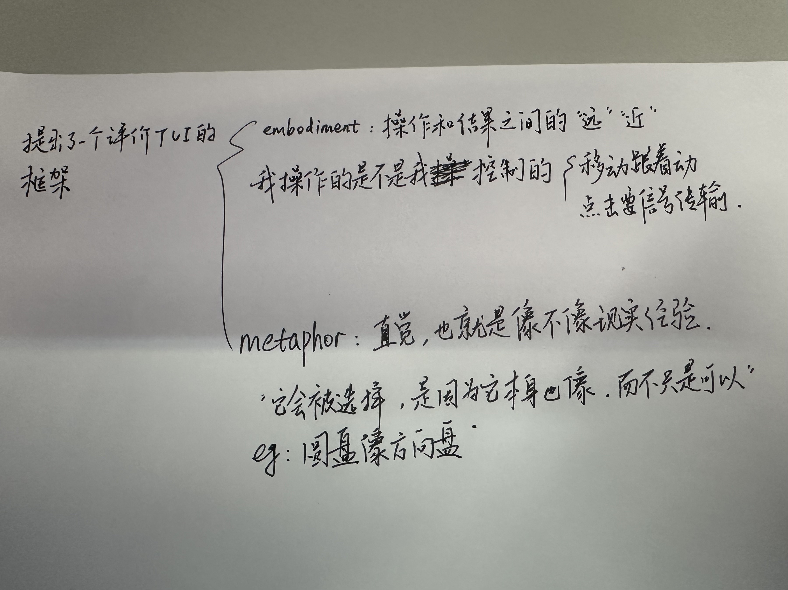

# Objestures: Everyday Objects Meet Mid-Air Gestures for Expressive Interaction
## 名词
EOIs：object-based interactions 基于对象的交互

MAIs：mid-air gesture interactions 空间手势交互

TUI：Tangible User Interface 可触式用户界面 / 实体用户界面
（用真实物体参与交互，强调：物理世界和数字世界的融合。而EOI是用“日常物体”做输入，不需要专门设计的设备。）

## affordance
affordance：这更像是一个心理学概念，例如一个杯子为什么让你想去“握”“转”和一个按钮为什么让你想去“按”就是它在起作用。来源于这篇文章：Affordance-Based and User-Defined Gestures for Spatial Tangible Interaction，我去看了这篇文章，这篇文章把这个概念讲得比较详细：

THE ECOLOGICAL APPROACH TO VISUAL PERCEPTION：这是一本书，指出affordance是环境“客观存在的行动可能性”，不依赖人的认知。

The Design of Everyday Things：：这也是一本书，把affordance引入 HCI：强调用户感知到的可操作性。

Activity Theory and Affordances：讲的是活动 / 环境的影响，但是其实这个和领域不相关。

Affordances in HCI: toward a mediated action perspective：它认为传统的affordance理论（第一本书）不适用于 HCI，核心观点是第一本书存在三个问题：1. 只考虑“人+自然环境”工具/技术/软件。2. 不考虑文化和社会，但是人的行为会受文化影响，技术使用有社会背景。3. 不考虑工具改变人的能力，这是最大的问题，因为人如果有手机就可以导航，有电脑的话可以建模（这个例子有点扯但是这篇文章也比较早了）。文章提出了核心理论：Mediated Action Perspective，其实就是affordance是人+工具+环境的产物。

A taxonomy for and analysis of tangible interfaces：提出了一种评价TUI的框架。

### 总结
我感觉就是三个概念：
1. Affordance决定能不能这么做。
2. Embodiment决定系统怎么响应。
3. Metaphor决定用户为什么觉得合理。

## 文章
1. Objestures 将交互从“依赖具体物体”转向“以手部动作模式为核心”的统一表达，虽然提升了灵活性与泛化能力，但也因此更依赖手部追踪，在遮挡或不可见情况下容易失效。
2. Objestures的核心思想（EOI–MAI统一）是从Affordance-Based and User-Defined Gestures for Spatial Tangible Interaction演化来的，将原本依赖具体物体的affordance，上升为一种动作模式（motion patterns），从而摆脱对特定物体的依赖。
3. 为了增强体验可以使用物体，但交互本身不应依赖物体，因此需要将交互抽象为可在有无物体条件下均可执行的动作模式。