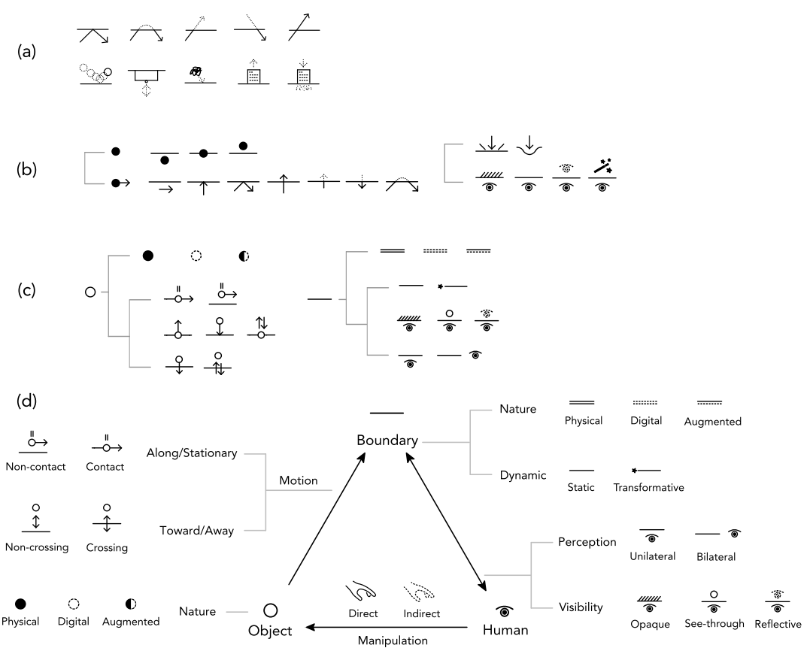
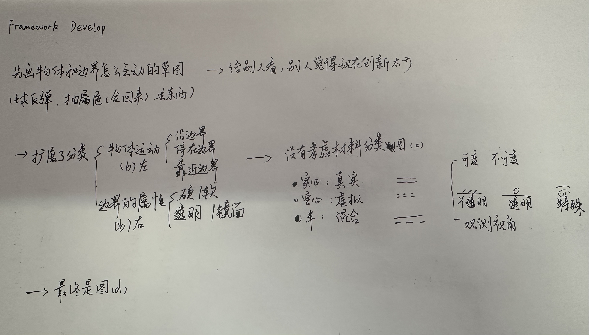
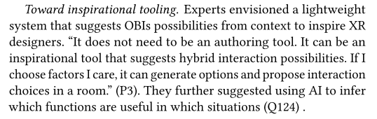

# Unbounded: Object-Boundary Interactions in Mixed Reality
兄弟，你没有什么赞，我给你点一个。

## 基础知识
VR（Virtual Reality）：完全进入虚拟世界，看不见现实。

AR（Augmented Reality）:叫增强现实，把虚拟东西叠在现实上。

MR（Mixed Reality）：混合现实，虚拟和现实能互相影响、能互动。

OBIs：Object-Boundary Interactions，物体和边界的交互。

## 文章的概念和创新点
1. 超越现实，指的是：变成巨人/飞行/让真实椅子视觉上消失/改变日常物体颜色/走在街上广告屏蔽/“控制时间流速”超能力（这个没懂，原文看看）。sensorimotor regularities（符合人的认知的规则。总之作者就是说他们也做超现实，但是又符合人的认知，不天马行空，同时提出了一种研究框架。（怎么样穿墙更合理？）
2. Tangible Bits envisioned coupling digital information with graspable objects in the physical environment.两条让数字走出屏幕的路线：一条是Tangible Bits（一种术语）把数字信息变成可以“摸”的实体，另一条是Liberated Pixels，想让像素从屏幕里解放出来，直接存在于三维空间中。一个是有触觉但是不自由，一个是自由但是没有触觉，所以作者想要结合，还提到了现有的两个工作：TriPad和Objestures。
3. HCI有很多设计空间，设计空间主要有以下几类：第一类是研究交互的设备的（屏幕的类型和传感器的属性）/第二类是研究交互的方式的（比如手势）/第三类包括了properties and interactions，举的例子是3D可视化（展示方式和操作方式是有关系的）和可形变界面以及portals设计能不能穿越（本文就是做这个的）。
4. RtD（Research through Design）是通过“设计和制作作品”来产生研究知识的一种研究范式。感觉提到的回忆型电台有点意思，虚拟葬礼有点阴间。

## 文章的系统
1. Framework Development写了文章的系统是怎么做的。

2. Section 2.2 将交互拆解为五个核心维度：物体本质、运动方式、边界属性、人对边界的感知，以及人对物体的操作，从而形成一个可组合的交互描述框架。第一 Object（分类：Physical 真实物体 / Digital 虚拟物体 / Augmented 真实 + 数字增强） 第二 Object → Boundary（分类：Along/Stationary 平行或静止（Contact 接触 / Non-contact 不接触） / Toward/Away 靠近或远离（Non-crossing 不穿越 / Crossing 穿越）） 第三 Boundary（分类：Nature 类型（Physical 真实 / Digital 虚拟 / Augmented 混合） / Dynamic 动态（Static 固定 / Transformative 可变化）） 第四 Human ↔ Boundary（分类：Perception 感知位置（Unilateral 单侧 / Bilateral 双侧） / Visibility 可见性（Opaque 不透明 / See-through 透明 / Reflective 反射）） 第五 Human → Object（分类：Direct 直接操作 / Indirect 间接操作）

## 演示视频
### 就是说，这个文章在重新定义边界！
1. 概念引入:几个球在桌面上弹了几下之后掉下去了。
2. 垃圾桶 / 墙壁写字 / 脆纸机 / 有一个拉起来降噪的（可能需要耳机）。
3. 艺术：有一个画框拉出 / 拉出一个抽屉（边界有隐藏空间），拉出来的东西放在镜子前可以抽象。 

## 文章缺陷
1. affordance不够明显，有的边界是隐藏空间，可能看不到。
2. 边界太物理化？无形边界（空气、个人空间） / 社交边界（人与人之间）**这是一个点** / 动态边界（随时间变化）

## 启发式工具（inspirational tool）和情境驱动交互

1. OBI推荐系统构建：基于环境上下文（如空间结构、边界类型）和用户任务需求，自动推荐合适的OBI交互方案，从而将静态设计空间转化为动态交互生成系统。 
2. 边界语义学习机制通过数据驱动方法学习不同边界的语义功能（如墙用于书写、桌面用于放置、镜面用于变换），以支持更符合用户认知的交互生成。
3. 基于大语言模型的交互生成方法：  利用大语言模型（LLM）理解自然语言输入（用户意图或设计需求），并结合 OBI 设计空间生成相应的交互组合，实现人机协同的设计辅助。

# Designing Virtual Funerals as a Design Fiction: A Film-Based Exploration of Near-Future Memorial Rituals
## 未来葬礼可以有的三大创新点
1. Hybrid：可以混合参与，现场有人屏幕前有人，而且两边的人可以互动。
2. 有一个虚拟纪念空间，可以存储对亡者悼念的数据。
3. Revisiting（可回访）：几年后再回去参加葬礼，原文的例子是主角两年后回去，看到别人新上传的记忆，对父亲的理解改变。本质上让哀悼变成了一个长期过程。
## 作者设计的虚构技术
虚拟葬礼网站 / 远程参与系统 / 可回访纪念空间 / 远程仪式包（邮寄香、花）

### 研究方法是拍成电影让观众看。
