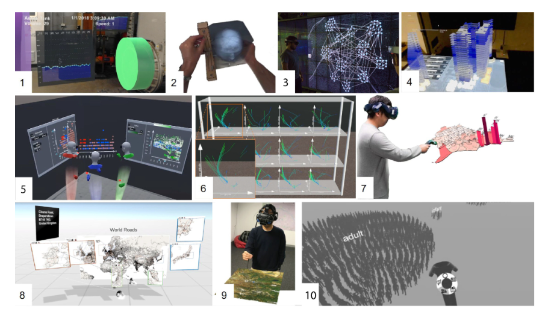
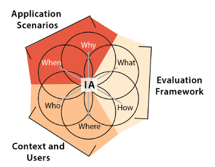
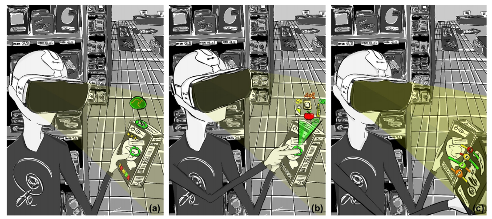
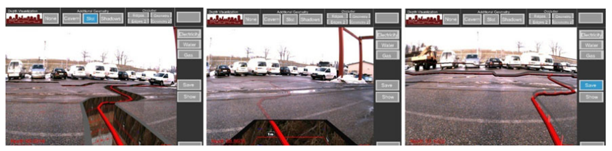
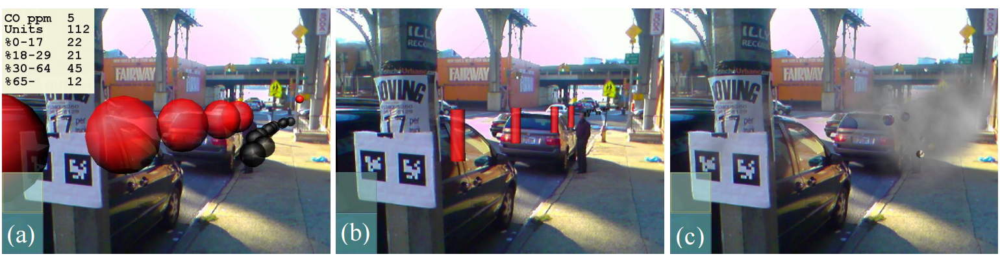
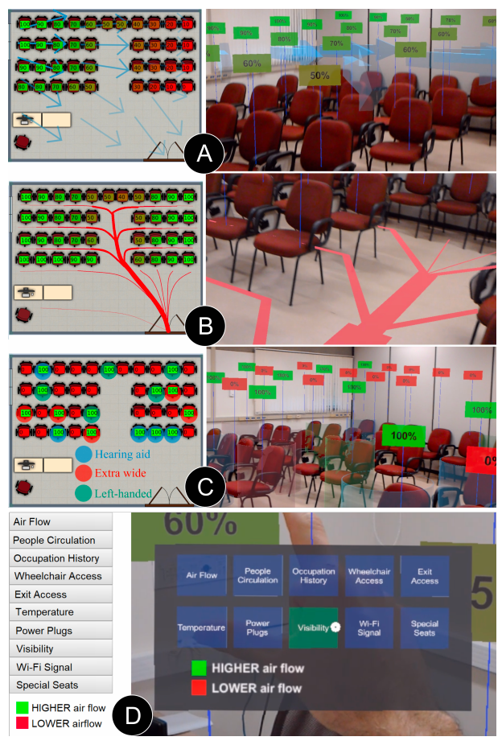
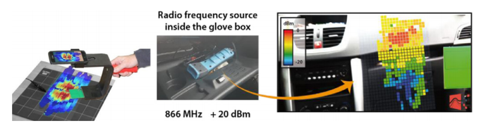
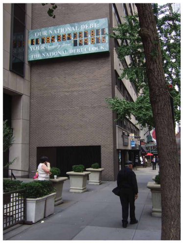
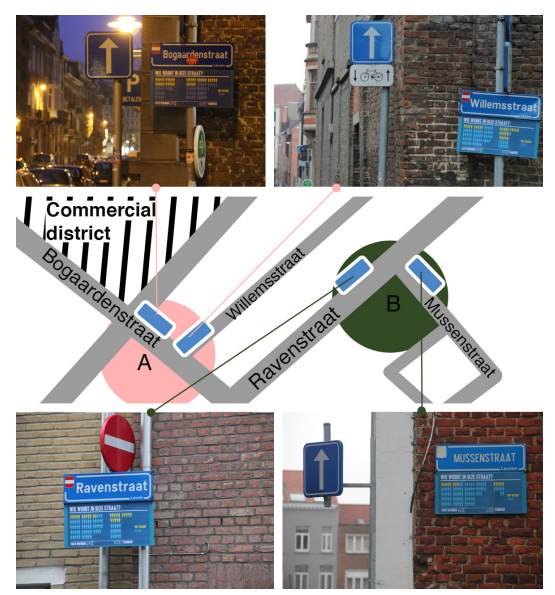

# What’s the Situation with Situated Visualization? A Survey and Perspectives on Situatedness

## 情景化的方向
traditional desktop applications就是用户坐着分析，交互设备主要鼠标键盘，显示介质主要是二维显示屏，数据与物理世界分离那种。情景可视化通过下面三个方向（有代表论文）来做出突破。

### 1.Ubiquitous Analytics
代表文章是Ubiquitous Analytics: Interacting with Big Data Anywhere, Anytime。Ubiquitous（无处不在的），它就是说数据可以在手机/平板/可穿戴设备进行分析，不应该局限在电脑前。

### 2.Immersive Analytics
代表文章有Immersive Analytics，它主要是提出了把数据分析放进“沉浸式空间”里这个想法。

具体的应用有一篇文章叫做Grand Challenges in Immersive Analytics，它里面有很具体的例子：图1展示了在真实工业设备上叠加实时数据的场景，说明数据可以直接附着于物理对象，实现设备状态的感知；图2通过手持物体进行测量与可视化，体现了数据分析与人体操作的紧密结合，强调身体参与（embodied interaction）；图3利用大尺寸显示呈现复杂网络结构，说明空间可以被用于表达高维关系数据，增强结构理解能力；图4在现实环境中叠加三维城市模型与统计数据；图5展示多用户围绕多屏系统进行协作分析，强调空间作为共享交互界面的作用；图6呈现三维科学数据（流体/轨迹）的沉浸式探索，说明空间环境有助于理解复杂动态数据；图7通过手势在增强现实地图上进行交互操作；图8展示在虚拟现实环境中构建的大规模信息空间，说明数据可以被组织为可探索的沉浸式环境；**图9没搞懂，确实是没搞懂**；图10则进一步将数据构建为包围用户的环境，使用户“置身于数据之中”，代表了完全沉浸式分析形态。

该领域对应了六个问题，六个问题对应了文章的六个部分，用一张图画出：

1. Why（为什么）：为什么要做这个分析？/目标是什么？/决策？探索？展示？
2. What（分析什么）：数据是什么？/数据类型（时间序列.空间.网络）/数据规模
3. How（怎么分析）方法和交互方式是什么？/手势.触控.语音/可视化形式
4. Where（在哪里）:分析发生在哪个空间？/VR空间？现实环境？AR叠加？
5. Who（谁在用）:用户是谁？/专家.普通用户/单人.多人协作
6. When（什么时候）:使用的时间特征？/实时分析？历史数据？长期使用？

对应Application Scenarios（应用场景）/Context and Users（用户与情境）/Evaluation Framework（评估框架）。

### 3.Situated Analytics
代表论文是Situated Analytics: Demonstrating immersive analytical tools with Augmented Reality，做了一个超市选购系统，可以分析数据，筛选，和指引。

### UbiComp = Ubiquitous Computing，把计算从设备迁移到环境，只有计算这个范畴。

## 情境化可视化（situated visualization）的两个定义
1. White和Feiner的定义：与环境相关，并在该环境中展示的可视化。只要你的可视化和环境有关，并且放在那个环境里，就算。
2. Willett等人的定义：引入了 physical data referent（物理参照物），并且关注数据（可视化的那个东西）和对应物体的关系。
3. Situated Analytics视角，代表论文是那个吃零食的。

## 具体文献
### Smart Vidente: advances in mobile augmented reality for interactive visualization of underground infrastructure
在现实世界中可视化地下管线，并支持现场测量和规划。

### iteLens: Situated Visualization Techniques for Urban Site Visits
原文的图片，显示污染的程度。

### Duopography: Using Back-of-Device Multi-Touch Input to Manipulate Spatial Data on Mobile Tangible Interactive Topography
3D的视角+2D的操作，但是感觉比较老了。

### Augmented Situated Visualization for Spatial and Context-Aware Decision-Making
用AR把数据直接叠加到真实空间中，帮助人做决策，进一个教室选座位要有好多考虑因素：温度/视野/WiFi/插座/是否拥挤/是否无障碍。

a图说空气怎么流动/b图说人怎么走/c图是座位的特殊属性。

### Augmented situated visualization methods towards electromagnetic compatibility testing
做物理现象的可视化，例子是电磁场。

## 交互和地方的关系
### Designing for the Situated and Public Visualization of Urban Data
城市开放数据很多，但没人能理解。作者想让普通人也能理解复杂数据，他就把信息可以放到城市里，可以理解为城市是一个数据系统。

图片是美国的国债时钟。还有能耗/环境污染啥的可以延申。

### Street Infographics: Raising Awareness of Local Issues through a Situated Urban Visualization
文章很具体地把社区数据直接贴到街道上，看居民会不会理解、讨论、甚至改变看法。他们选了两个路口（A和B）分布在四条街，其中A：人流多
/B：人流中等。

